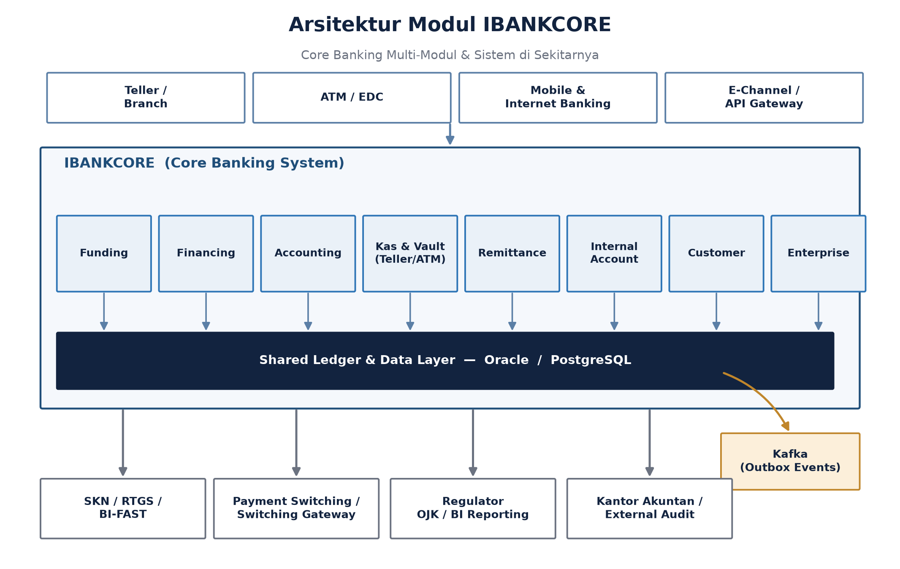
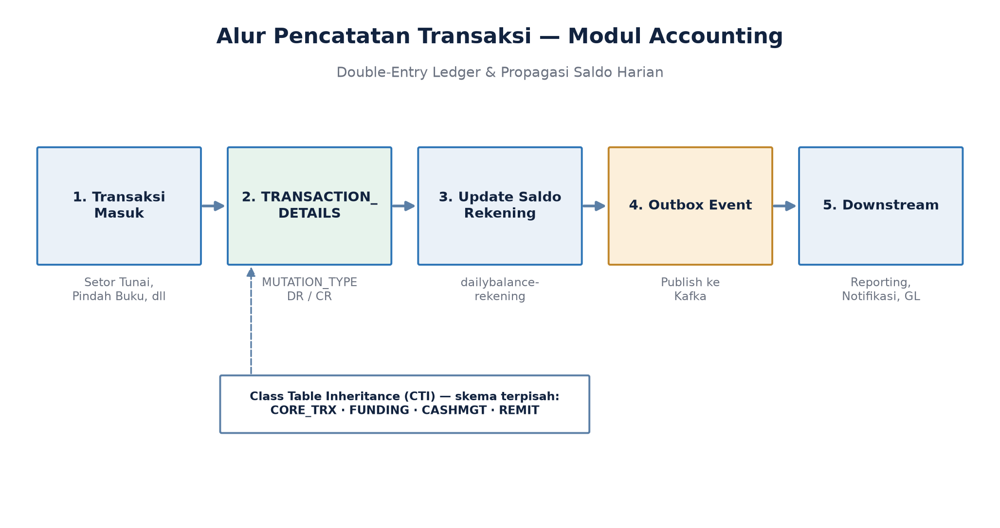
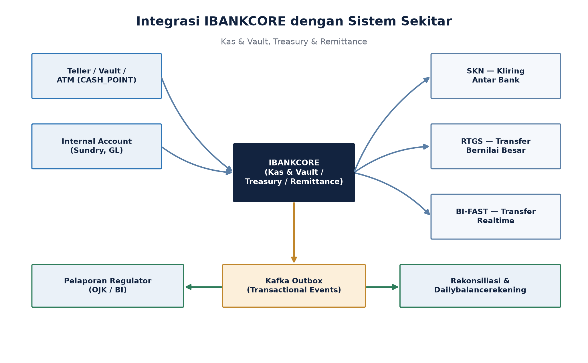
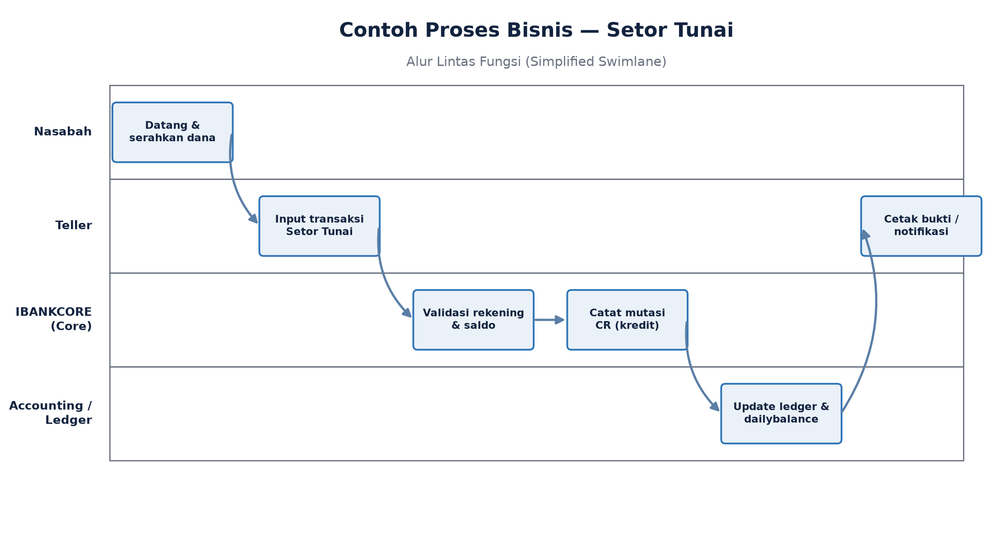

# 1. Pendahuluan

## 1.1 Tujuan Training

Sesi ini bertujuan memberikan pemahaman menyeluruh (overview) mengenai sistem core banking IBANKCORE, khususnya modul Accounting, Funding, dan Treasury (Kas & Vault), serta bagaimana ketiga modul tersebut berinteraksi satu sama lain maupun dengan aplikasi/sistem di sekitarnya (channel, sistem kliring, regulator, dan platform integrasi).

Materi disusun untuk audiens campuran — baik yang berlatar belakang teknis (developer, DBA) maupun bisnis (business analyst, product owner, auditor) — sehingga penjelasan konsep akan diberikan pada level arsitektur dan proses bisnis, sebelum masuk ke detail data model bila diperlukan.

## 1.2 Ruang Lingkup

- Arsitektur modul IBANKCORE secara keseluruhan (Funding, Financing, Accounting, Kas & Vault, Remittance, Internal Account, Customer, Enterprise).
- Prinsip pencatatan transaksi (double-entry ledger) pada modul Accounting.
- Konsep dasar modul Funding (produk pendanaan/simpanan).
- Konsep Treasury / Kas & Vault (Teller/ATM), termasuk abstraksi CASH_POINT (teller, vault, ATM, sundry).
- Struktur organisasi cabang & departemen, serta manajemen user dan hak akses (role, limit otorisasi).
- Interaksi dengan sistem sekitar: event streaming (Kafka), kliring & pembayaran (SKN, RTGS, BI-FAST), serta pelaporan regulator (OJK/BI).
- Contoh proses bisnis end-to-end: Setor Tunai dan Pindah Buku.
- Produk & layanan tambahan: Deposito, Kliring, Teller & Layanan Counter, QRIS & Virtual Account, Host-to-Host & REST API, Corporate Banking, Manajemen Rekening & Nasabah (CIF), Biller & Remittance, integrasi SAP/GL eksternal, dan produk Dana Haji.
- Operasional batch & kontinuitas layanan: End-of-Day/Begin-of-Day (EOD/BOD) cabang, serta backup & disaster recovery.
- Keamanan, otorisasi, dan audit lanjutan: mekanisme maker-checker (OtorEntri), user security & access control, session/block management, dan verifikasi biometrik.
- Konteks regulasi & syariah (PSAK 109) yang relevan dengan sebagian produk pembiayaan.

## 1.3 Konteks Lingkungan

IBANKCORE beroperasi pada lingkungan perbankan yang diatur (regulated), tunduk pada ketentuan OJK/BI serta audit eksternal. Sistem berjalan di atas basis data Oracle dan PostgreSQL, dengan kode sumber dikelola pada instance GitLab internal (self-hosted).

# 2. Arsitektur Modul IBANKCORE

IBANKCORE adalah sistem core banking multi-modul. Setiap modul menangani domain bisnis tertentu namun berbagi lapisan data (shared ledger) dan pola integrasi yang konsisten. Diagram berikut menggambarkan posisi setiap modul beserta kanal dan sistem sekitarnya.

## 2.1 Modul-Modul Utama

| Modul | Fungsi Utama |
|---|---|
| Funding | Produk pendanaan/simpanan nasabah (tabungan, giro, deposito). |
| Financing | Produk pembiayaan, termasuk skema syariah (Murabahah, Ijarah, Kafalah). |
| Accounting | Pencatatan transaksi double-entry, buku besar (GL), saldo harian. |
| Kas & Vault (Teller/ATM) | Pengelolaan kas fisik: teller, vault, ATM, sundry (CASH_POINT). |
| Remittance | Transfer dana antar bank: SKN, RTGS, BI-FAST. |
| Internal Account | Rekening internal bank (GL internal, suspense, sundry account). |
| Customer | Data induk nasabah (CIF), identitas, profil risiko. |
| Enterprise | Fungsi lintas modul: parameter, otorisasi, audit trail. |

## 2.2 Lapisan Data

Seluruh modul berbagi lapisan data pada Oracle dan/atau PostgreSQL. Pemisahan skema dilakukan dengan pola Class Table Inheritance (CTI) lintas skema — misalnya CORE_TRX, FUNDING, CASHMGT, REMIT — agar setiap modul dapat memiliki atribut spesifik tanpa mengorbankan konsistensi struktur transaksi inti.

## 2.3 Kanal & Sistem Sekitar

Transaksi dapat masuk melalui berbagai kanal (teller/cabang, ATM/EDC, mobile & internet banking, maupun API gateway). Di sisi hilir, IBANKCORE terhubung dengan sistem kliring/pembayaran (SKN/RTGS/BI-FAST), kebutuhan pelaporan regulator (OJK/BI), serta kebutuhan audit eksternal.

## 2.4 Aplikasi Core vs Enterprise

Secara implementasi, IBANKCORE terdiri dari dua aplikasi terpisah namun saling terkait: **core** dan **enterprise**.

- **Aplikasi Core** — mesin transaksi & produk perbankan itu sendiri: logika akun, transaksi, jurnal, serta seluruh produk (Deposito, Tabungan, Kliring, Teller, Corporate) dan integrasi kanal (QRIS, host-to-host, REST API). Aplikasi ini dideploy per-instansi/bank, ditandai dengan konfigurasi lingkungan terpisah seperti training, UAT, dan production.
- **Aplikasi Enterprise** — modul platform/administratif di atas core: manajemen user & cabang, keamanan & hak akses, mekanisme otorisasi (maker-checker), proses batch operasional (EOD/BOD), backup/disaster recovery, serta monitoring sesi user.
- Kedua aplikasi berbagi prinsip dan pola arsitektur yang sama (lapisan data, struktur transaksi), namun **core** berfokus pada domain bisnis/produk sedangkan **enterprise** berfokus pada domain administrasi, keamanan, dan operasional platform.

# 3. Modul Accounting

Modul Accounting adalah jantung pencatatan finansial IBANKCORE. Prinsip utamanya adalah double-entry bookkeeping — setiap transaksi selalu menghasilkan pasangan mutasi debit (DR) dan kredit (CR) yang seimbang.

## 3.1 Struktur Pencatatan

- TRANSACTION_DETAILS — tabel inti yang menyimpan detail setiap mutasi, dengan atribut MUTATION_TYPE bernilai DR (debit) atau CR (kredit).
- dailybalancerekening — saldo harian per rekening, yang direkonsiliasi terhadap akumulasi mutasi debit/kredit dari tabel transaksi historis dan berjalan.
- Setiap transaksi bisnis (Setor Tunai, Pindah Buku, dsb.) pada akhirnya diterjemahkan menjadi satu atau lebih pasangan entri DR/CR yang tersimpan secara atomik.

## 3.2 Alur Pencatatan Transaksi

## 3.3 Event & Outbox

Setelah mutasi tercatat, sistem mempublikasikan event melalui pola transactional outbox ke Kafka. Pola ini menjaga konsistensi antara perubahan data di database dan event yang dikirim ke konsumen hilir (reporting, notifikasi, modul GL lain), tanpa risiko event hilang atau terkirim ganda.

## 3.4 Audit & Rekonsiliasi

Karena berada dalam lingkungan yang diaudit, modul Accounting perlu mendukung: jejak audit (audit trail) yang lengkap, kemampuan rekonsiliasi saldo (membandingkan saldo tersimpan vs. hasil rekonstruksi dari mutasi), dan deteksi anomali seperti duplikasi transaksi.

# 4. Modul Funding

Modul Funding mengelola produk-produk pendanaan/simpanan nasabah — misalnya tabungan, giro, dan deposito. Modul ini menjadi sumber utama dana pihak ketiga (DPK) bank.

## 4.1 Cakupan Fungsional

- Pembukaan dan pemeliharaan rekening simpanan.
- Perhitungan bagi hasil/bunga sesuai jenis produk (konvensional maupun syariah).
- Integrasi dengan modul Accounting untuk pencatatan mutasi rekening (setoran, penarikan, pemindahbukuan).
- Integrasi dengan modul Customer untuk validasi identitas dan profil nasabah.

## 4.2 Keterkaitan dengan Modul Lain

Setiap transaksi pada rekening Funding (misalnya Setor Tunai) akan memicu pencatatan pada modul Accounting (DR/CR) dan, bila melibatkan kas fisik, berinteraksi dengan modul Kas & Vault melalui abstraksi CASH_POINT.

## 4.3 Produk Deposito

Deposito adalah salah satu produk Funding dengan karakteristik jangka waktu dan perhitungan bagi hasil/bunga tersendiri, mencakup beberapa proses khusus.

- **Perhitungan bunga/bagi hasil** — dihitung berdasarkan nominal, jangka waktu, dan nisbah/suku bunga yang berlaku pada saat pembukaan atau perpanjangan deposito.
- **Pencairan awal (premature withdrawal)** — pencairan sebelum jatuh tempo, umumnya dikenakan penalti atau penyesuaian bagi hasil sesuai kebijakan bank.
- **Perubahan nisbah** — penyesuaian porsi bagi hasil (untuk produk syariah) yang dapat berlaku pada perpanjangan otomatis (roll-over) deposito.

# 5. Modul Treasury / Kas & Vault (Teller/ATM)

Modul Kas & Vault mengelola pergerakan kas fisik dan likuiditas bank, termasuk kas teller, vault (khazanah), ATM, dan rekening sundry.

> **Catatan istilah**: modul ini berbeda dengan istilah industri "Cash Management System (CMS)", yang umumnya merujuk pada portal/aplikasi web bagi nasabah korporat (CIF) untuk kebutuhan pembayaran massal, koleksi, dan monitoring likuiditas multi-rekening. Modul yang dibahas di sini secara spesifik menangani manajemen kas fisik internal cabang (laci teller, vault, ATM, sundry), bukan kanal digital nasabah korporat.

## 5.1 Abstraksi CASH_POINT

CASH_POINT adalah abstraksi yang menyeragamkan berbagai titik penyimpanan/perputaran kas — baik itu laci teller, vault cabang, mesin ATM, maupun rekening sundry — sehingga logika pengelolaan saldo kas dapat digeneralisasi lintas titik tersebut.

## 5.2 Fungsi Treasury

- Pengelolaan likuiditas harian dan posisi kas bank.
- Rekonsiliasi kas fisik terhadap catatan sistem.
- Interaksi dengan Remittance untuk kebutuhan settlement lintas bank (SKN, RTGS, BI-FAST).

## 5.3 Modul Teller & Layanan Counter

Modul Teller/Layanan Counter merepresentasikan alur transaksi front office di cabang — titik interaksi langsung antara nasabah dan sistem melalui CASH_POINT laci teller.

- Mendukung ragam transaksi counter (setor, tarik, pemindahbukuan, layanan lain) dalam satu alur kerja teller yang konsisten.
- Setiap transaksi teller tervalidasi terhadap saldo kas fisik pada CASH_POINT terkait sebelum dicatat ke modul Accounting.
- Menjadi titik awal (entry point) paling umum bagi sebagian besar contoh proses bisnis (lihat Bagian 8).

# 6. Manajemen Cabang, Departemen & User

Selain modul-modul fungsional (Funding, Accounting, Treasury, dsb.), IBANKCORE juga memiliki lapisan struktur organisasi — cabang, departemen, dan user — yang menjadi atribut wajib pada hampir setiap transaksi maupun aktivitas sistem. Lapisan ini dikelola terutama melalui modul Enterprise dan Customer.

## 6.1 Struktur Organisasi: Cabang & Departemen

- **Cabang (Branch)** — unit operasional yang melayani nasabah secara langsung (tatap muka maupun melalui kanal cabang). Setiap cabang memiliki kode unik (kode cabang) yang menjadi atribut wajib pada transaksi yang terjadi di cabang tersebut.
- **Departemen** — unit di kantor pusat (head office) yang umumnya bersifat back office/non-transaksional, misalnya Departemen Treasury, Departemen Accounting, Departemen Kepatuhan, atau Departemen IT. Departemen lebih banyak berfungsi sebagai cost center/unit organisasi untuk keperluan GL dan pelaporan manajerial dibandingkan sebagai titik transaksi nasabah.
- **Hierarki Wilayah** — cabang dapat dikelompokkan ke dalam area/wilayah/regional untuk keperluan agregasi laporan manajerial (mis. kinerja cabang per wilayah).

## 6.2 Kode Cabang sebagai Atribut Transaksi

- Setiap transaksi (Setor Tunai, Pindah Buku, dsb.) membawa kode cabang tempat transaksi dilakukan atau diinisiasi.
- TRANSACTION_DETAILS dan dailybalancerekening turut menyimpan kode cabang, sehingga saldo dan mutasi dapat direkonsiliasi maupun dilaporkan per cabang.
- Setiap CASH_POINT (laci teller, vault, ATM) selalu terasosiasi ke satu kode cabang tertentu, sehingga posisi kas fisik dapat dipantau per cabang.

## 6.3 Manajemen User & Hak Akses

- User sistem — mulai dari teller, customer service, supervisor cabang, branch manager, hingga user di kantor pusat/departemen — dikelola melalui modul Enterprise.
- Setiap user umumnya terikat ke satu kode cabang atau departemen tertentu, yang menentukan lingkup data dan transaksi yang dapat dilihat maupun diproses oleh user tersebut.
- Role-Based Access Control (RBAC) — peran (role) menentukan menu, jenis transaksi, dan limit otorisasi yang dapat diakses oleh user, misalnya perbedaan hak akses antara teller, supervisor, dan branch manager.
- Limit otorisasi berjenjang (approval limit) — transaksi dengan nilai di atas limit tertentu memerlukan persetujuan (approval) dari user dengan peran/level lebih tinggi, sesuai prinsip maker-checker atau dual control.

## 6.4 Segregasi & Pelaporan Berdasarkan Cabang/Departemen

- Modul Internal Account menggunakan kode departemen sebagai cost center untuk pencatatan biaya/pendapatan non-operasional pada buku besar (GL).
- Laporan manajerial (mis. volume transaksi per cabang, kinerja cabang) direkonstruksi dari agregasi TRANSACTION_DETAILS berdasarkan kode cabang.
- Audit trail pada modul Enterprise mencatat user, kode cabang/departemen, serta waktu setiap aksi — mendukung kebutuhan investigasi maupun kepatuhan (OJK/BI, audit eksternal).

# 7. Interaksi dengan Aplikasi & Sistem Sekitar

## 7.1 Event Streaming — Kafka

IBANKCORE menggunakan pola transactional outbox untuk mempublikasikan event transaksi ke Kafka. Pendekatan ini memungkinkan sistem-sistem hilir (reporting, notifikasi, modul lain) berlangganan event tanpa perlu mengakses langsung basis data inti, sekaligus menjaga loose coupling antar sistem.

## 7.2 Kliring & Pembayaran Antar Bank

| Sistem | Karakteristik |
|---|---|
| SKN | Kliring nasional untuk transaksi bernilai relatif kecil; proses batch. |
| RTGS | Transfer bernilai besar, real-time gross settlement. |
| BI-FAST | Transfer real-time antar bank untuk nilai kecil-menengah, tersedia 24/7. |

## 7.3 Pelaporan Regulator & Audit Eksternal

Sebagai entitas yang diawasi OJK dan BI, IBANKCORE perlu mendukung pelaporan berkala (mis. laporan keuangan, laporan transaksi, laporan kepatuhan) serta menyediakan jejak data yang dapat ditelusuri untuk kebutuhan audit eksternal.

## 7.4 Modul Kliring

Selain kliring sebagai sistem pembayaran antar bank (SKN, lihat 7.2), IBANKCORE memiliki modul transaksi kliring tersendiri yang menangani pencatatan dan pemrosesan warkat/instruksi kliring nasabah sebelum diteruskan ke sistem kliring nasional.

## 7.5 QRIS & Virtual Account

- **QRIS** — kanal pembayaran berbasis kode QR standar nasional; transaksi QRIS masuk melalui integrasi channel pihak ketiga dan diselesaikan (settlement) ke rekening tujuan melalui proses tersendiri.
- **Virtual Account (VA)** — nomor rekening virtual yang dipetakan ke rekening nasabah/tujuan sebenarnya, umumnya dipakai untuk penagihan (billing) atau penerimaan pembayaran; pencocokan (matching) pembayaran VA dilakukan secara terjadwal (batch).

## 7.6 Host-to-Host & REST API

Selain kanal konvensional, IBANKCORE menyediakan integrasi host-to-host serta REST API bagi sistem eksternal (mis. aplikasi mitra, agregator pembayaran) untuk memicu transaksi maupun menarik data secara terprogram, mengikuti kontrak/format pesan yang telah disepakati (request/response berbasis JSON).

## 7.7 Integrasi Akuntansi Eksternal (SAP)

Untuk kebutuhan konsolidasi keuangan pada level korporasi/holding, IBANKCORE dapat mengirimkan posting akuntansi secara batch ke sistem akuntansi eksternal seperti SAP, sebagai pelengkap pencatatan GL internal pada modul Accounting.

# 8. Contoh Proses Bisnis

## 8.1 Setor Tunai

Proses Setor Tunai melibatkan nasabah, teller, modul core (validasi & pencatatan), hingga modul Accounting/Ledger untuk pembaruan saldo. Diagram berikut menggambarkan alur lintas fungsi secara sederhana.

## 8.2 Pindah Buku

Pindah Buku (transfer antar rekening dalam bank yang sama) mengikuti pola serupa dengan Setor Tunai, namun tanpa melibatkan kas fisik — mutasi DR terjadi pada rekening sumber dan mutasi CR pada rekening tujuan secara bersamaan (atomik), tanpa keterlibatan modul Kas & Vault.

# 9. Produk & Layanan Tambahan

Selain modul-modul inti (Bagian 3-8), IBANKCORE mendukung sejumlah produk dan layanan tambahan yang memperluas cakupan bisnis bank.

## 9.1 Corporate Banking

Layanan khusus untuk nasabah korporat — mencakup parameter dan fitur yang berbeda dari nasabah ritel, seperti otorisasi transaksi bertingkat sesuai struktur kewenangan perusahaan nasabah.

## 9.2 Manajemen Rekening & Nasabah (CIF)

Modul ini menangani siklus hidup data nasabah dan rekening — mulai dari pembukaan Customer Information File (CIF), pembukaan rekening, pemeliharaan data, hingga penutupan rekening — dan menjadi rujukan identitas/profil yang divalidasi oleh modul Funding maupun Financing saat transaksi terjadi.

## 9.3 Biller & Remittance

- **Biller** — integrasi pembayaran tagihan pihak ketiga (listrik, telekomunikasi, dan sejenisnya) melalui antarmuka biller tersendiri.
- **Remittance** — pengiriman/penerimaan dana lintas bank maupun lintas negara, melengkapi kanal kliring/RTGS/BI-FAST yang telah dibahas pada Bagian 7.

## 9.4 Dana Haji

Produk pembiayaan/simpanan khusus untuk kebutuhan dana haji, dengan aturan dan skema pencatatan tersendiri yang tetap mengikuti prinsip double-entry pada modul Accounting.

# 10. Operasional Batch & Kontinuitas Layanan

## 10.1 Batch Process & EOD/BOD

Operasional cabang mengikuti siklus harian yang dikelola melalui proses batch:

- **End-of-Day (EOD)** — rangkaian proses tutup hari yang memastikan seluruh transaksi hari tersebut telah tercatat, saldo direkonsiliasi, dan cabang dapat ditutup secara sistem.
- **Begin-of-Day (BOD)** — proses pembukaan hari kerja baru, termasuk persiapan cabang (branch open) sebelum transaksi hari itu dapat dimulai.
- Proses ini memastikan konsistensi data antar hari operasional dan menjadi prasyarat sebelum laporan harian maupun pelaporan regulator dapat disusun.

## 10.2 Backup & Disaster Recovery

Untuk menjaga kontinuitas layanan, IBANKCORE mendukung mekanisme backup database secara berjenjang (mis. backup penuh maupun incremental) serta prosedur disaster recovery, sebagai bagian dari kepatuhan terhadap kebutuhan ketahanan operasional (business continuity) perbankan.

# 11. Keamanan, Otorisasi & Audit Lanjutan

Selain hak akses dasar dan audit trail yang telah dibahas pada Bagian 6, IBANKCORE menerapkan beberapa mekanisme keamanan dan kontrol tambahan yang penting untuk dipahami.

## 11.1 Maker-Checker / Otorisasi

Prinsip maker-checker (dual control) diimplementasikan melalui mekanisme otorisasi entri (OtorEntri) — transaksi atau perubahan data tertentu dicatat dalam status "menunggu otorisasi" dan baru berlaku efektif setelah disetujui oleh user lain dengan kewenangan yang sesuai. Riwayat otorisasi (termasuk siapa yang mengajukan dan siapa yang menyetujui/menolak) tersimpan sebagai jejak audit tersendiri, terpisah dari data transaksi utama.

## 11.2 User Security & Access Control

Selain Role-Based Access Control dasar (lihat 6.3), sistem menyediakan validasi keamanan data user, pencatatan aktivitas user (activity log), serta laporan hak akses (daftar menu/hak akses per user maupun per grup) yang mendukung kebutuhan audit periodik terhadap kesesuaian hak akses dengan peran pekerjaan.

## 11.3 Session & Block Management

Sistem memantau dan mengelola sesi login user, termasuk kedaluwarsa sesi (session expiry) dan pemblokiran otomatis user setelah kondisi tertentu (mis. percobaan login gagal berulang), sebagai kontrol keamanan tambahan terhadap akses tidak sah.

## 11.4 Verifikasi Biometrik

Untuk transaksi atau proses yang memerlukan tingkat keyakinan identitas lebih tinggi, IBANKCORE mendukung verifikasi biometrik nasabah sebagai lapisan otentikasi tambahan di luar PIN/password konvensional.

# 12. Konteks Regulasi & Produk Syariah

Sebagian produk pada modul Financing mengikuti prinsip syariah dan mengacu pada PSAK 109, mencakup skema seperti Murabahah (jual-beli dengan margin), Ijarah (sewa), dan Kafalah (penjaminan). Perlakuan akuntansi untuk skema-skema ini memiliki kekhususan dibandingkan produk konvensional, dan tetap harus konsisten dengan prinsip double-entry pada modul Accounting.

# 13. Ringkasan

- IBANKCORE adalah sistem core banking multi-modul yang berbagi lapisan data dan pola integrasi yang konsisten, terdiri dari dua aplikasi utama: core (mesin transaksi/produk) dan enterprise (platform, keamanan, operasional).
- Modul Accounting menjadi pusat pencatatan double-entry yang menopang seluruh modul lain.
- Modul Funding dan Kas & Vault/Treasury saling terkait erat dalam setiap transaksi yang melibatkan dana maupun kas fisik, termasuk produk khusus seperti Deposito.
- Struktur cabang, departemen, dan user/hak akses menjadi lapisan pengendalian yang melekat pada hampir seluruh transaksi dan aktivitas sistem.
- Interaksi dengan sistem sekitar (Kafka, SKN/RTGS/BI-FAST, QRIS, host-to-host/REST API, regulator) menjadi bagian penting dari arsitektur end-to-end.
- Produk & layanan tambahan (Corporate Banking, Biller & Remittance, Dana Haji, dsb.) memperluas cakupan bisnis di luar produk simpanan/pembiayaan dasar.
- Operasional batch (EOD/BOD) dan backup/disaster recovery menjaga konsistensi data dan kontinuitas layanan dari hari ke hari.
- Mekanisme maker-checker (otorisasi), user security, session/block management, dan verifikasi biometrik menjadi lapisan kontrol keamanan yang penting dipahami baik oleh audiens teknis maupun bisnis/audit.
- Diskusi lanjutan dapat difokuskan ke salah satu area untuk pendalaman lebih lanjut, misalnya detail data model, pola integrasi, atau studi kasus incident/rekonsiliasi.

## Bahan Diskusi

- Modul mana yang paling relevan untuk didalami lebih lanjut oleh masing-masing peserta?
- Apakah ada isu integrasi atau kepatuhan yang ingin dibahas lebih jauh?
- Bagaimana pengelolaan hak akses/limit otorisasi saat ini dijalankan di masing-masing cabang/departemen?
- Bagaimana mekanisme maker-checker (otorisasi) saat ini diterapkan untuk transaksi bernilai besar atau berisiko tinggi?
- Seberapa sering proses EOD/BOD dan backup/disaster recovery diuji atau mengalami kendala di lapangan?
